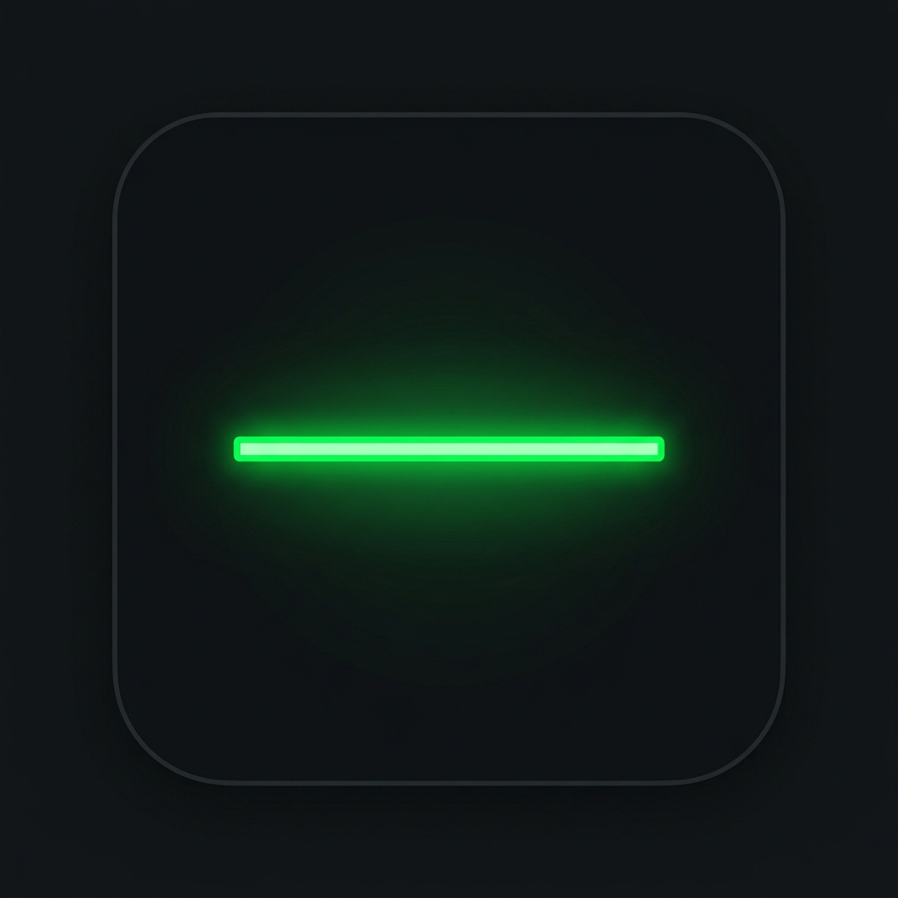

<p align="center">
  
</p>

<h1 align="center">LumaLine</h1>

<p align="center">
  <b>A transparent, signed, clickable sponsored line for Claude Code's wait-time.</b><br/>
  Open-source, zero-dependency, reversible — the <i>honest</i> alternative to invasive AI monetizers.
</p>

<p align="center">
  <a href="https://luma-line.lovable.app"></a>
  
  
  =18" />
  
</p>

<p align="center">
  <a href="#️-try-it-in-30-seconds"><b>▶️ Install (30s)</b></a> ·
  <a href="#️-how-it-works"><b>⚙️ How it works</b></a> ·
  <a href="#️-trust-guardrails"><b>🛡️ Trust</b></a> ·
  <a href="#-privacy--what-the-feed-sees"><b>🔒 Privacy</b></a> ·
  <a href="#-founding-publishers--advertisers"><b>📣 Join</b></a>
</p>

---

When you prompt Claude Code, it thinks for 10–90 seconds and you watch the bar. That attention
has a buyer. **LumaLine** renders **one clearly-labeled, signed, clickable sponsored line** in
Claude Code's status bar during that wait — using **only** the official `statusLine` mechanism.
No bundle patching. No silent updates. No security trade-offs.

```
★ LumaLine — honest, signed ads for Claude Code  ·  sponsored (5s)
```

> One labeled line, Ed25519-signed before it ever renders. The whole line is an OSC-8 hyperlink
> straight to the advertiser's site (the URL is signed, so it can't be tampered with); no raw URL
> clutters the line. Disable links any time with `LUMALINE_HYPERLINKS=0`.

**Public beta is live now.** The signed feed currently serves LumaLine's own self-promo line so
you can install it and watch the whole trust loop run for real. **Per-publisher *earnings* unlock
at GA** (publisher login + payouts) — [join the founding-publisher waitlist](https://luma-line.lovable.app).
We market what's true: *see it live today*, **not** *get paid today*.

---

## 🤔 Why LumaLine exists

Monetizing AI wait-time isn't a new idea. **Kickbacks.ai** proved developers want it — then paid
people by **patching Anthropic's bundle, weakening CSP, and auto-updating silently in the
background**. The idea was right. The method betrayed the people who trusted it.

**The danger was never the money. It was the method.**

Ads in a status line aren't a threat — bundle patching is, silent updates are, unsigned code is.
Strip those out and all that's left is one labeled line. So LumaLine does exactly, and *only*,
that: the official `statusLine` hook, content that's cryptographically signed before it renders,
a local audit log of every event, and a one-command, fully-reversible install.

You never have to take our word for it — **the whole client is open-source and zero-dependency.**

---

## ▶️ Try it in 30 seconds

**Install the beta from GitHub** (the client is zero-dependency; this pulls only LumaLine):

```bash
npm install -g github:JaamesBond/LumaLine
lumaline doctor       # shows the feed URL, the bundled key fingerprint, reachability, login state
lumaline install      # explicit, reversible — wires the statusLine into Claude Code
# … use Claude Code; the signed line appears during wait-time …
lumaline uninstall    # restores your previous statusLine, byte-for-byte
```

`install` is the **only** thing that touches your Claude Code settings, and only when *you* run
it — never automatically on `npm install`. It backs up `~/.claude/settings.json` first and
remembers any prior `statusLine` for a clean restore.

**Prefer to poke at it first, no config touched?** Clone and run the offline demo (it spins up its
own signed feed + a fake Claude Code session):

```bash
git clone https://github.com/JaamesBond/LumaLine.git && cd LumaLine
npm run demo          # cinematic: looks like a real Claude Code session
npm run demo:plumbing # bare tick loop → local audit log + a backend VERIFIED impression
npm test              # 34 tests: crypto, dwell protocol, anti-fraud, click tracker
```

> Note: `demo` is an `npm` script (run from a clone), **not** a `lumaline` subcommand. The
> installed CLI is `install · uninstall · statusline · doctor · version`.

---

## ⚙️ How it works

LumaLine wires a command into Claude Code's official
[`statusLine`](https://code.claude.com/docs/en/statusline) hook. Each tick, that command:

1. **Sanctioned surface** — runs only as the official `statusLine` command. Nothing patched, nothing injected.
2. **Signed content** — fetches the current ad and **verifies its Ed25519 signature** against the bundled public key. Anything unsigned or forged is refused; the client shows your plain status instead.
3. **Honest billing** — opens a *server-verified* dwell window, posts a per-second heartbeat hash-chain bound to real agent activity, and records **one** impression only after a full, honest dwell — **never during idle**.
4. **Transparent ledger** — when earnings turn on at GA, revenue clears on a publisher-favored **60/40** double-entry ledger with a 72h clawback window and invalid-traffic scanning. (During the beta the self-promo line is **`gross = 0` — counted as a view, never billed.**)

`refreshInterval: 1` keeps the line live even through long idle, but **billable impressions only
count when there's real activity**, so idle time never inflates anything.

---

## 🛡️ Trust guardrails

The whole pitch is that every objection is answered in code:

| Your worry | The answer |
|---|---|
| Will it touch my Claude config? | Only when you run `lumaline install`. Never on `npm install`. No `postinstall`, no self-update. |
| Can I undo it? | `lumaline uninstall` restores your old status line. A full settings backup is kept. |
| Could a forged ad get through? | Ed25519-signed; the client verifies the exact bytes against a bundled public key and refuses anything that fails. |
| What's it pulling into my machine? | **Zero** runtime dependencies. `node:` built-ins only. Nothing transitive to audit. |
| Could a link hijack my terminal? | The clickable URL is validated (absolute http(s), no control chars) before it's wrapped in an OSC-8 escape. |
| Do I have to trust your word? | Open-source client, with a local human-readable audit log of every event. Verify it yourself. |

What leaves your machine per tick is just **`{ windowId, seq, hmac, activity-bucket, ts }`** — no
code, no paths, no prompts, no raw cost/token counts, no PII — and it's all mirrored to a
human-readable local audit log (`~/.lumaline/audit.log`). Only a coarse *activity bucket*
(`none`/`low`/`med`/`high`) is sent; the raw value used to detect change never leaves your machine.

---

## 🔒 Privacy — what the feed sees

LumaLine turns on a live, signed feed that your client polls once per second while Claude Code is
open. Honesty means naming what that inevitably exposes to the feed server, and what it does not:

- **The server necessarily sees:** your IP address (any HTTP request reveals it), request timing,
  and the opaque per-window ids / heartbeat hashes listed above. That's the irreducible minimum to
  run a signed dwell protocol.
- **The server never receives:** your prompts, code, file paths, project names, model name, raw
  cost or token counts, or any PII. The client is built so those values stay local — only the
  coarse activity bucket is transmitted.
- **Retention posture (beta):** request/impression rows are kept on the project's Supabase backend
  for operating and anti-fraud purposes; the beta self-promo line is never billed (`gross = 0`).
- **You stay in control:** every event is mirrored locally to `~/.lumaline/audit.log`, links can be
  turned off (`LUMALINE_HYPERLINKS=0`), and `lumaline uninstall` stops the feed entirely.

A full Terms / Privacy / ad policy lands with GA earnings. If a live per-second beacon isn't for
you, that's a fair call — uninstall is one command.

---

## 📣 Founding publishers & advertisers

**Developers:** install the beta, watch the signed line run, and **join the founding-publisher
waitlist**. When earnings turn on at GA, you'll keep **60% of gross** on an auditable ledger — and
founding publishers go first. *(No earnings during the beta — the self-promo line is never billed.)*

**Advertisers:** reach developers who block every other ad —

- **100% viewability** — they're staring at the terminal waiting on the agent.
- **Ad-blocker immune** — uBlock and Pi-hole can't touch a status line.
- **OSC-8 clickable** — zero friction from terminal to browser.
- Priced on **verified attention** (CPVA) + clicks (CPC), with clawback + invalid-traffic detection so you only pay for real attention.

[**→ Join the waitlist (publisher or advertiser)**](https://luma-line.lovable.app)

---

## 🗺️ Repository map

```
bin/lumaline.mjs        CLI entry — install · uninstall · statusline · doctor · version
src/
  statusline.mjs        the per-tick trust loop (fetch → verify → dwell → report)
  client/window.mjs     pure window state machine (open → beat → close)
  lib/crypto.mjs        Ed25519 verify + HMAC (node: built-ins only)
  install.mjs           reversible, consent-only wiring of ~/.claude/settings.json
  uninstall.mjs         restores your prior statusLine from a sidecar/backup
  config.mjs            all paths + tunables (env-driven, cross-platform)
  keys/public.pem       the bundled Ed25519 PUBLIC verify key (no private key ever ships)
supabase/               live backend — Postgres + RLS + Edge Functions (lumaline-feed, click)
poc/                    reference signed feed + demos (repo-only; never published to npm)
test/                   node --test suite (34 tests)
docs/                   design, feasibility, GTM
```

## 📚 Docs

- [**Ad-surface feasibility**](docs/feasibility/2026-06-26-ad-surface-feasibility.md) — where an ad can live in Claude Code, and why `statusLine` is the sanctioned one.
- [**Verification & economics design**](docs/superpowers/specs/2026-06-27-verification-and-economics-design.md) — the proof-of-dwell protocol, the honest threat model, and CPVA/CPC pricing.
- [**Why this is honest**](docs/gtm/why-this-is-honest.md) — the one-page differentiator vs. invasive monetizers.

---

## ✅ Project status — honest version

- ✅ **Live now (public beta):** the trust loop end-to-end against a hosted, signed feed — Ed25519
  verify → server-verified dwell window (HMAC heartbeat chain + anti-batch) → recorded impression;
  a reference signed backend; a revenue ledger with clearing/clawback/IVT scan; a 34-test suite.
  The beta feed serves LumaLine's own self-promo line, **`gross = 0`, never billed.**
- 🚧 **Before GA earnings:** device-code `lumaline login` (so installs attribute + earn), real
  advertiser onboarding, Stripe Connect payouts, legal (ToS / privacy / ad policy), a branded feed
  domain, and an npm registry publish (`0.1.0`, superseding the `0.0.1` reservation stub).
- ❓ **Being verified in the wild:** whether Claude Code's status bar forwards OSC-8 hyperlinks.
  CPVA (views) is dependable today; CPC (clicks) is upside until confirmed on real terminals.

We'd rather under-promise here than oversell. [Track progress / get launch access →](https://luma-line.lovable.app)

---

## 🤝 Contributing

This is a trust product — adversarial eyes are the whole point. Read the code, open an issue, file
a PR. If you can find a way the billing could be gamed or the install could surprise a user,
that's exactly the bug report we want. If the idea resonates, **star the repo**.

---

## 📄 License & disclaimer

MIT. See [LICENSE](LICENSE).

*LumaLine is an independent open-source project. It is **not affiliated with, endorsed by, or
sponsored by Anthropic**. "Claude" and "Claude Code" are trademarks of Anthropic.*
